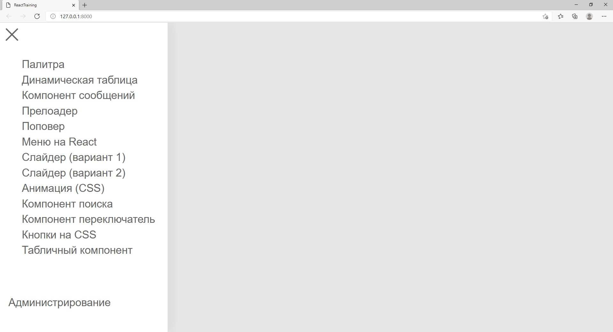
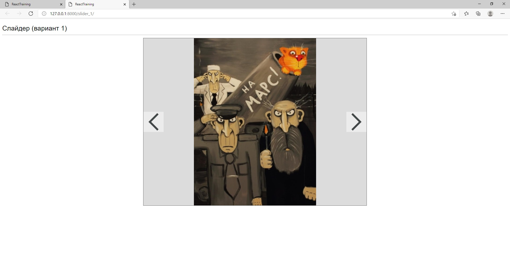
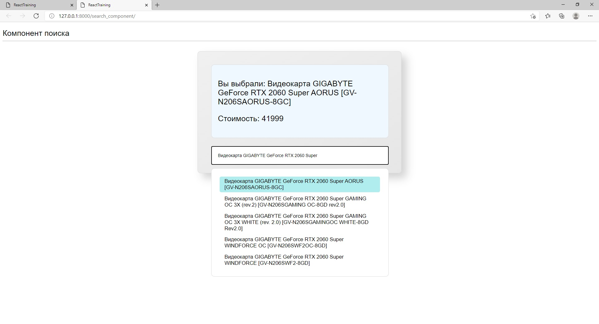
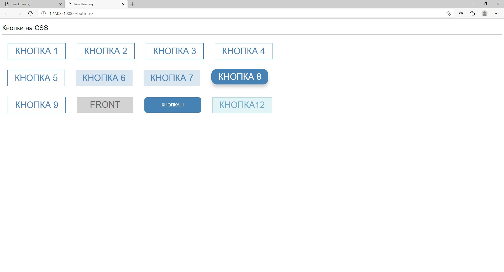
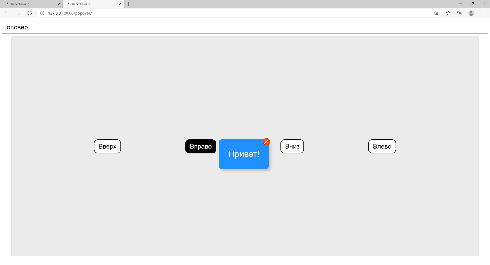

#ReactTraining

Это учебный проект, подобный тем, что я уже писал раньше: [этому](https://github.com/SergeyLebidko/JsTraining)
или [этому](https://github.com/SergeyLebidko/DjangoTraining).

Суть таких проектов не в том, чтобы создать какой-то законченный программный продукт, а в
том, чтобы поразбираться с какой-то новой программной технологией (в данном случае
React и CSS). В это проекте я просто создаю несколько страниц и на каждой из них обкатываю
разработку какого-то простого компонента: кнопки, слайдера, поля поиска, таблицы, подгружающей
данные из хука с пагинацией и т.д.

Так как я отрабатываю в этом проетке работу с компонентами интерфейса, то все же
приведу здесь скриншоты проекта (хотя для подобных проектов раньше этого не делал).

